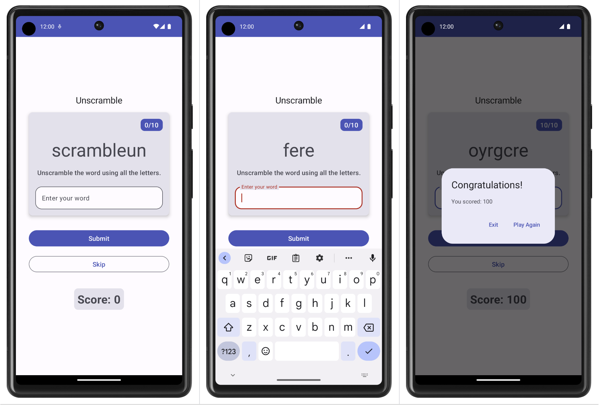

Unscramble app
=================================

Single player game app that displays scrambled words. To play the game, player has to make a
word using all the letters in the displayed scrambled word.
This code demonstrates the Android Architecture component- ViewModel and StateFlow.

The Unscramble app is a single player word scrambler game. The app displays a scrambled word, and the player has to guess the word using all the letters shown. The player scores points if the word is correct. Otherwise, the player can try to guess the word any number of times. The app also has an option to skip the current word. In the top right corner, the app displays the word count, which is the number of scrambled words played in the current game. There are 10 scrambled words per game.

Unscramble 应用程序是一款单人单词拼写游戏。应用程序会显示一个乱序词，玩家必须使用显示的所有字母来猜出该单词。如果单词正确，玩家将获得分数。否则，玩家可以尝试猜单词任意次数。该应用程序还有一个选项可以跳过当前单词。在右上角，应用程序显示单词数，即当前游戏中玩的乱序词数。每个游戏有 10 个乱序词。

   

